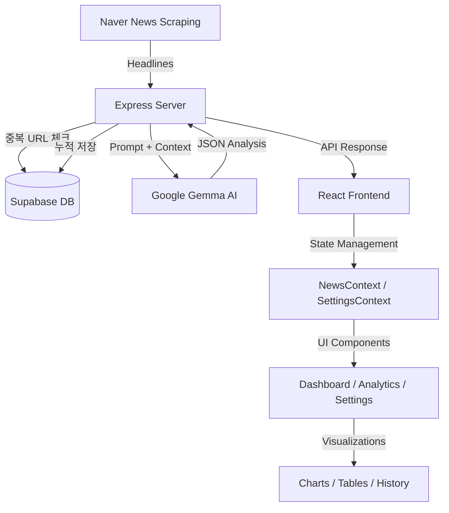

# AI 기반 뉴스 트렌드 분석 모니터링 시스템

네이버 뉴스 헤드라인을 수집하고 Google Gemma AI로 실시간 트렌드·감성 분석을 수행하는 대시보드 시스템입니다. 분석 결과는 Supabase에 누적 저장되어 일간·주간·월간 데이터 조회가 가능합니다.

---

## 🏗 System Architecture



### 데이터 흐름
1. **Scraping**: `server.ts`에서 `cheerio`로 네이버 뉴스 6개 섹션(정치·경제·사회·생활문화·IT과학·세계) 헤드라인 최대 18개 수집
2. **중복 방지**: 직전 세션과 URL 70% 이상 겹치면 DB 저장 생략 (Gemma 분석과 병렬 실행)
3. **AI Analysis**: Gemma 3 모델(12b·27b 로테이션)로 트렌드 요약·감성 분석·키워드 추출
4. **DB 저장**: 분석 결과를 Supabase 4개 테이블에 자동 저장 (세션·카테고리·키워드·기사)
5. **Visualization**: React + Recharts + Glassmorphism UI로 데이터 시각화

---

## 📂 Directory Structure

```text
news_dash/
├── src/
│   ├── components/
│   │   ├── Dashboard.tsx       # 메인 대시보드 (스탯 카드, 키워드 순위, 뉴스 요약)
│   │   ├── Analytics.tsx       # 기간별 심층 분석 (현재세션·오늘·7일·30일 탭)
│   │   ├── Articles.tsx        # 기사 목록 (감성 필터링)
│   │   ├── Settings.tsx        # 설정 페이지 (테마·수집·모델·데이터 관리)
│   │   ├── Header.tsx          # 헤더 (검색바, 테마 토글)
│   │   ├── Sidebar.tsx         # 사이드바 네비게이션
│   │   ├── GlassCard.tsx       # Glassmorphism 카드 컴포넌트
│   │   ├── SentimentGauge.tsx  # 감성 분포 패널 (stacked bar)
│   │   └── TrendChart.tsx      # Recharts 기반 트렌드 차트
│   ├── context/
│   │   ├── NewsContext.tsx      # 뉴스 데이터 전역 상태
│   │   ├── SettingsContext.tsx  # 설정값 전역 상태 + localStorage 동기화
│   │   └── ThemeContext.tsx     # 다크/라이트 모드 관리
│   ├── App.tsx                 # 앱 진입점 및 레이아웃
│   ├── main.tsx
│   └── index.css               # 글로벌 스타일 (orb 애니메이션, glassmorphism)
├── docs/
│   └── FUTURE_PLANS.md         # DB 스키마, 기획, 우선순위
├── server.ts                   # Express 백엔드 (Scraping + Gemma + Supabase)
├── vercel.json
└── package.json
```

---

## 🛠 Tech Stack

### Frontend
- **Framework**: React 19 + Vite 6
- **Styling**: Tailwind CSS v4, Glassmorphism, CSS orb 애니메이션
- **Icons**: Lucide React
- **Visualization**: Recharts
- **State**: React Context API (News, Settings, Theme)

### Backend
- **Runtime**: Node.js + Express
- **AI**: `@google/generative-ai` — Gemma 3 (12b-it / 27b-it 로테이션)
- **DB**: Supabase (PostgreSQL) — `@supabase/supabase-js`
- **Scraper**: Cheerio
- **Dev**: tsx (TypeScript 직접 실행)

---

## 🚀 주요 기능

| 기능 | 설명 |
|------|------|
| **실시간 뉴스 수집** | 네이버 뉴스 6개 카테고리 헤드라인 최대 18개 수집 |
| **AI 트렌드 분석** | Gemma 3 모델로 뉴스 요약·트렌드·키워드 추출 |
| **감성 분석** | 기사·키워드별 긍정/중립/부정 분류 + 1~100점 점수 |
| **키워드 순위** | score 기준 내림차순 정렬, progress bar 시각화 |
| **누적 DB 저장** | 세션별 분석 결과 Supabase에 자동 저장 |
| **중복 방지** | 직전 세션 URL 70% 이상 겹치면 저장 생략 |
| **기간별 분석** | Analytics 탭에서 오늘·7일·30일 히스토리 조회 |
| **반복 키워드 추적** | 기간 내 등장 횟수 기준 TOP 20 키워드 집계 |
| **감성 추이 차트** | 일별 긍정/부정/중립 비율 stacked bar |
| **설정 페이지** | 테마·카테고리·기사 수·Temperature 설정 (localStorage) |
| **다크/라이트 모드** | CSS orb 애니메이션 + Glassmorphism 완전 지원 |
| **검색 기능** | 실시간 키워드 필터링 + 최근 검색어 히스토리 |

---

## 🗄 Database Schema (Supabase)

```sql
news_sessions      -- 수집 세션 (수집시각, 기사수, 모델, 에러여부)
category_stats     -- 카테고리별 집계 (카테고리명, 기사수, 평균감성)
keyword_stats      -- 키워드 (키워드, score, sentiment)
article_summaries  -- 기사 요약 (제목, 요약, 카테고리, URL, 감성, 점수)

-- View
keyword_trends     -- 키워드 장기 트렌드 (등장횟수, 평균점수, 감성별 카운트)
```

상세 스키마 및 쿼리: `docs/FUTURE_PLANS.md`

---

## 📡 API Endpoints

| Method | Path | 설명 |
|--------|------|------|
| GET | `/api/news-analysis` | 실시간 크롤링 + Gemma 분석 |
| GET | `/api/history/sessions?period=today\|7d\|30d` | 세션 목록 조회 |
| GET | `/api/history/keywords?period=7d\|30d` | 반복 키워드 집계 TOP 20 |
| GET | `/api/history/sentiment?period=7d\|30d` | 일별 감성 추이 |

---

## 🧠 AI 감성 분석

Gemma 3 모델이 각 기사와 키워드에 대해 자연어 이해 기반으로 심리적 온도를 측정합니다.

| 점수 | 상태 | 의미 |
|------|------|------|
| 80~100 | 매우 긍정 | 호재 지배적, 시장 분위기 매우 밝음 |
| 60~80 | 긍정적 | 전반적으로 원만하거나 발전적 소식 |
| 45~60 | 중립적 | 사실 위주 보도, 긍부정 혼재 |
| 30~45 | 다소 부정 | 우려되는 소식이나 갈등 상황 감지 |
| 0~30 | 부정적 | 위기 상황이나 강한 비판 여론 |

**Gemma 특이사항**: JSON 모드(`responseMimeType`) 미지원 → `extractAndFixJson()`으로 파싱 보정, 파싱 실패 시 `is_error=TRUE`로 DB 저장 후 UI에 안내 메시지 표시.

---

## 🏃 로컬 실행

**Prerequisites**: Node.js v18+

```bash
# 1. 의존성 설치
npm install

# 2. 환경변수 설정 (.env)
GEMINI_API_KEY=...
SUPABASE_URL=https://<project>.supabase.co
SUPABASE_KEY=<service_role_key>   # anon 키 아님, service_role 키 사용

# 3. 개발 서버 실행
npm run dev
# → http://localhost:3000
```

> `vercel dev`는 Express + Vite 통합 구조와 충돌 → `npm run dev` 사용

---

## ✨ 업데이트 이력

### 2026-04-19
- **Supabase 연동 완료**: 세션·카테고리·키워드·기사 4개 테이블 자동 저장
- **중복 세션 방지**: URL 70% 이상 겹치면 DB 저장 생략 (Gemma 분석과 병렬 처리)
- **기간별 Analytics**: 오늘·7일·30일 히스토리 탭 + 반복 키워드·감성 추이 시각화
- **Settings 페이지**: 테마·카테고리·기사수·Temperature·DB 상태·검색어 초기화
- **키워드 순위 수정**: Gemma 반환 순서 → score 내림차순 정렬
- **UI 정리**: Bell 알림 버튼·LogOut 버튼·아바타 제거
- **AI 모델 변경**: Gemini → Gemma 3 (12b-it / 27b-it 로테이션)
- **SentimentGauge 컴포넌트**: 감성 분포 stacked bar + 비율 표시

### 2026-04-15
- 타입 정합성 확보 (서버 응답 ↔ 프론트 타입 일치)
- 보안 수정: `GEMINI_API_KEY` 클라이언트 번들 노출 차단
- 환경변수 로딩 개선: `.env.local` 우선 로드

### 2026-03-15
- Vercel 서버리스 배포 안정화
- Vite lazy loading으로 서버리스 500 에러 해결
- 라이트 모드 대비 개선

---

## 🗺 로드맵

- [x] 실시간 뉴스 수집 및 AI 분석
- [x] 다크/라이트 모드 + Glassmorphism UI
- [x] 감성 분석 고도화 (키워드·기사별 점수)
- [x] Supabase 연동 및 데이터 누적 저장
- [x] 기간별 히스토리 분석 (오늘·7일·30일)
- [x] 반복 키워드 추적 및 감성 추이 차트
- [ ] Delta 증감 수치 UI (직전 세션 대비 ↑↓)
- [ ] Settings 설정값 → API 실제 반영 (카테고리 필터·기사 수·Temperature)
- [ ] Vercel Cron Job 자동 수집 (1일 1회)

---

## 📄 라이선스

Apache-2.0
