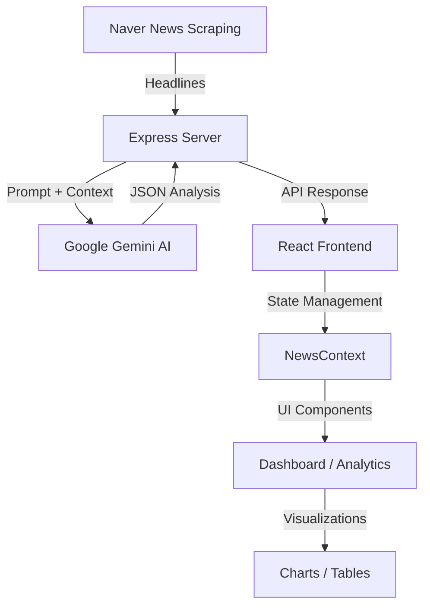

# AI 기반 뉴스 트렌드 분석 모니터링 시스템

---

이 프로젝트는 네이버 뉴스의 최신 헤드라인을 수집하고, Google Gemini AI를 활용하여 실시간 트렌드 분석, 카테고리 분류 및 감성 분석을 제공하는 대시보드 시스템입니다.

## 🏗 System Architecture



###  fluxo 설명
1. **Scraping**: `server.ts`에서 `cheerio`를 사용하여 네이버 뉴스 6개 섹션(정치, 경제, 사회 등)의 헤드라인을 수집합니다.
2. **AI Analysis**: 수집된 데이터를 Google Gemini 모델(2.5 Flash, 2.5 Flash-lite 등)에 전달하여 트렌드 요약, 감성 분석 및 키워드 추출을 수행합니다.
3. **Data Delivery**: 분석된 결과는 JSON 형태로 프론트엔드 API(` /api/news-analysis`)를 통해 제공됩니다.
4. **Visualization**: 프론트엔드에서는 `Recharts`를 사용하여 트렌드를 시각화하고, `Glassmorphism` 스타일의 UI로 정보를 직관적으로 노출합니다.

## 📂 Directory Structure

```text
news_monitoring/
├── news_dash/
│   ├── src/
│   │   ├── components/       # 재사용 가능한 UI 컴포넌트 (Sidebar, Header, GlassCard 등)
│   │   │   ├── Articles.tsx    # 수집된 개별 뉴스 카드 목록
│   │   │   ├── Analytics.tsx   # 트렌드 분석 차트 및 통계
│   │   │   ├── Dashboard.tsx   # 메인 대시보드 레이아웃
│   │   │   └── TrendChart.tsx  # Recharts 기반 트렌드 시각화
│   │   ├── context/          # 전역 상태 관리 (News, Theme)
│   │   ├── App.tsx           # 메인 애플리케이션 진입점 및 레이아웃 구성
│   │   ├── main.tsx          # React DOM 렌더링
│   │   └── index.css         # 글로벌 스타일 및 테마 정의
│   ├── server.ts             # Express 기반 백엔드 (Scraping + Gemini API API 연동)
│   ├── package.json          # 프로젝트 의존성 및 스크립트
│   ├── tsconfig.json         # TypeScript 설정
│   └── vite.config.ts        # Vite 빌드 및 프록시 설정
```

## 🛠 Tech Stack

### Frontend
- **Framework**: React 19 (Vite)
- **Styling**: Tailwind CSS (Modern Vanilla Config), Framer Motion
- **Icons**: Lucide React
- **Visualization**: Recharts
- **State**: React Context API (News, Theme)

### Backend
- **Runtime**: Node.js (Express)
- **AI**: @google/generative-ai (Gemini 2.5 Flash / Lite, Gemma 3)
- **Scraper**: Cheerio
- **Dev Tools**: tsx (Direct TypeScript Execution)

## 🚀 주요 기능

- **실시간 뉴스 수집**: 네이버 뉴스 6개 카테고리의 상위 헤드라인 자동 수집.
- **AI 기반 트렌드 분석**: Gemini 및 Gemma 모델을 활용한 뉴스 요약 및 트렌드 도출.
- **감성 분석 (Sentiment Analysis)**: 뉴스 내용의 심리적 온도를 😊/😐/😟 아이콘과 점수로 시각화.
- **고도화된 검색 시스템**: 
    - 실시간 키워드 하이라이팅 (본문/제목 강조).
    - 최근 검색어 히스토리 (localStorage 연동).
    - 카테고리/감성 통합 필터링.
- **시스템 안정성**: AI 응답 처리 로직 강화를 통한 JSON 파싱 에러 방지 및 복구 가능.
- **프리미엄 UI/UX**: 글래스모피즘 기반의 현대적 디자인과 완벽한 다크 모드 지원.
- **라이트 모드 최적화**: 라이트 모드에서의 가독성 문제를 해결하고, Tailwind v4 테마 전략을 최적화하여 부드러운 테마 전환 제공.

## ✨ 최근 주요 업데이트 (2026.03.15)

### 1. Vercel 배포 및 안정화
- **빌드 오류 수정**: `@vercel/static-build`와 `@vercel/node`를 혼합 구성하여 Vite + Express 구조의 배포 안정성 확보.
- **런타임 최적화**: 서버리스 환경에서의 부하를 줄이기 위해 `vite` 의존성을 동적 임포트(Lazy Loading)로 변경하여 500 에러 해결.
- **환경 변수 유연성**: `GEMINI_API_KEY`의 대소문자 구분을 없애 환경 설정 편의성 증대.

### 2. 디자인 및 가독성 개선
- **라이트 모드 고도화**: 흰색 배경에서 글씨가 보이지 않던 문제를 해결하기 위해 텍스트 및 배경 대비(Contrast)를 전면 수정.
- **Tailwind v4 연동**: 최신 Tailwind v4의 다크 모드 전략을 수동 선택(Selector) 방식으로 설정하여 테마 토글의 일관성 유지.

### 3. AI 감성 분석 고도화
- **정밀도 향상**: Gemini 프롬프트를 상세화하여 뉴스별 긍정/부정/중립 분류의 정확도와 감성 점수(1-100)의 신뢰도를 높임.
- **실시간 데이터 연동**: 대시보드와 분석 차트의 데이터를 가공된 AI 분석 데이터로 교체하여 실제 트렌드를 반영.
- **개별 기사 필터링**: 이제 '최신 뉴스' 탭에서 AI가 분류한 감성 상태별로 뉴스를 필터링하여 볼 수 있습니다.

## 🧠 AI 감성 분석 로직

이 시스템은 단순한 키워드 매칭을 넘어, AI 모델의 자연어 이해 능력을 바탕으로 뉴스의 **'심리적 온도'**를 측정합니다.

### 1. 분석 프로세스
1. **데이터 전달**: 수집된 뉴스 헤드라인과 카테고리 정보를 Gemini/Gemma 모델에게 전달합니다.
2. **감성 분류**: AI가 각 기사 또는 카테고리의 톤을 `positive`, `neutral`, `negative`로 분류합니다.
3. **강도 측정**: 해당 감성의 강도를 1~100 사이의 점수(`score`)로 수치화합니다.

### 2. 지수 해석 가이드
사용자는 대시보드의 **감성 분석** 점수를 통해 다음과 같이 시장의 심리를 파악할 수 있습니다.

| 점수 범위 | 아이콘 | 상태 | 의미 |
| :--- | :---: | :--- | :--- |
| **80 - 100** | 😊 | **매우 긍정** | 호재가 지배적이며 시장 분위기가 매우 밝음 |
| **60 - 80** | 🙂 | **긍정적** | 전반적으로 원만하거나 발전적인 소식이 많음 |
| **45 - 60** | 😐 | **중립적** | 사실 위주 보도이거나 긍부정 요소가 혼재됨 |
| **30 - 45** | 😕 | **다소 부정** | 우려되는 소식이나 갈등 상황이 감지됨 |
| **0 - 30** | 😟 | **부정적** | 위기 상황이나 강한 비판적 여론이 형성됨 |

## 🛠 개발 진행 상황 및 로드맵

- [x] 프로젝트 초기 환경 구성 및 UI 컴포넌트 개발.
- [x] AI 분석 모델 연동 및 한글 로컬라이징 완료.
- [x] 테마 시스템(Dark Mode) 및 프리미엄 디자인 최적화.
- [x] AI 분석 안정화 (JSON 잘림 수정, Gemma 모델 호환성 확보).
- [x] **Phase 1 완료**: 실시간 데이터 기반 분석 차트 연동.
- [x] **Phase 2 완료**: 뉴스 검색 및 감성 필터링 고도화.
- [x] **Vercel 최적화**: 서버리스 환경 배포 및 안정성 확보.
- [ ] **[작업 예정]** Supabase 연동을 통한 데이터 영구 저장 및 히스토리 관리.
- [ ] **[작업 예정]** 주간/월간 뉴스 트렌드 자동 보고서 생성.

## 📅 향후 계획 (Supabase 연동 기획)

수집된 뉴스와 분석 데이터를 영구적으로 저장하기 위해 Supabase 도입을 계획하고 있습니다.

1. **데이터 아카이빙**: 매일 수집되는 뉴스 분석 결과(Trends, Sentiment)를 테이블에 저장하여 과거 데이터 조회 가능.
2. **검색 히스토리 동기화**: 브라우저 로컬 스토리지를 넘어 계정 기반의 검색 히스토리 및 북마크 기능 제공.
3. **분석 데이터 레이크**: 누적된 데이터를 기반으로 주간/월간 단위의 심층 트렌드 리포트 생성 기능 구현.

## 🏃 Run Locally

**Prerequisites:** Node.js (v18+)

1. 의존성 설치:
   ```bash
   npm install
   ```
2. 환경 설정:
   `.env` 파일에 `GEMINI_API_KEY`를 설정하세요.
3. 로컬 서버 실행:
   ```bash
   npm run dev
   ```

## 🌐 Deployment (배포)

이 프로젝트는 Docker를 지원하며, 다양한 클라우드 플랫폼에 쉽게 배포할 수 있습니다.

### Docker를 이용한 배포
1. 이미지 빌드:
   ```bash
   docker build -t news-monitoring .
   ```
2. 컨테이너 실행:
   ```bash
   docker run -p 3000:3000 --env GEMINI_API_KEY=your_key_here news-monitoring
   ```

### 추천 플랫폼
- **Vercel / Railway / Fly.io**: GitHub 레포지토리를 연동하면 자동으로 빌드 및 배포가 진행됩니다.
- 배포 시 `GEMINI_API_KEY` 환경 변수를 반드시 설정해야 합니다.

## 📄 라이선스

Apache-2.0
